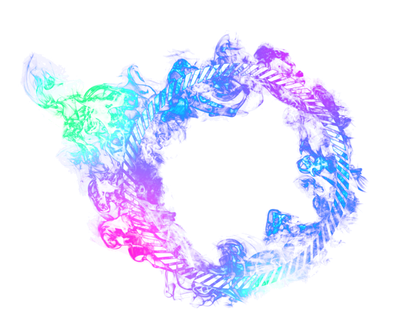
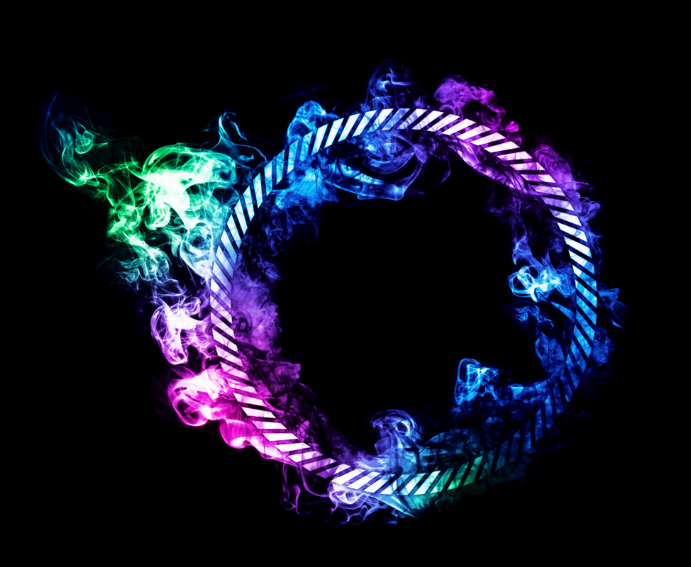
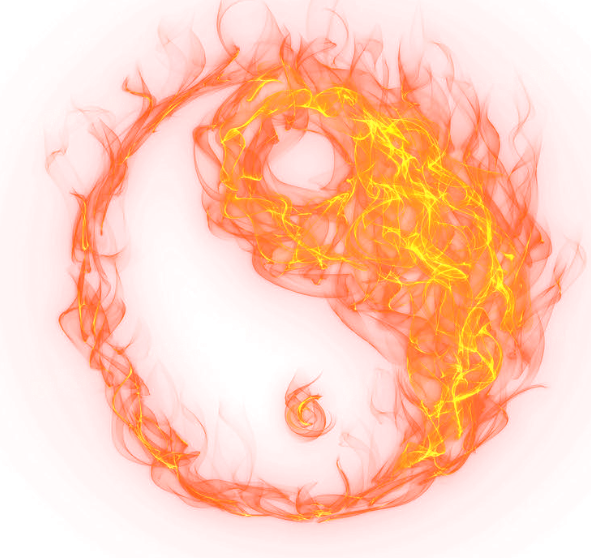
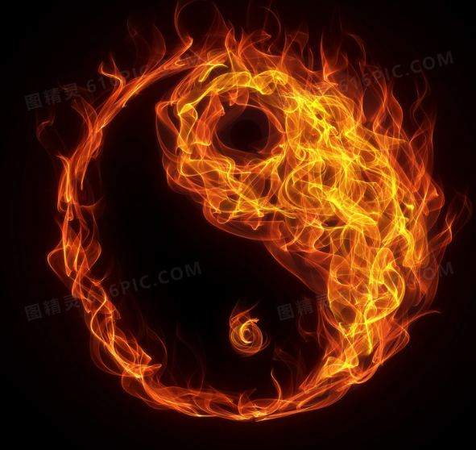

# Eliminate-Black-through-black

Desaturation code created using Python Pillow.  

The effect is equivalent to Photoshop's fire, ice, smoke, and water decolorization.

## Example Images  
Below are the generated effect images:

### Group A  
  
  

### Group B  
  
  
